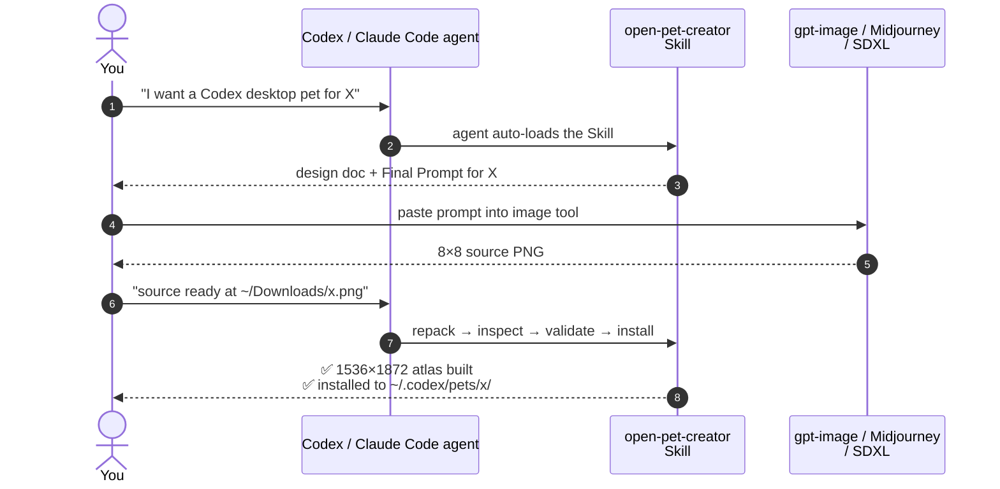

# open-pets

> Custom desktop pets for [Codex CLI](https://github.com/openai/codex) and [Claude Code](https://www.anthropic.com/claude-code), plus a reusable AI Skill that turns generated chibi sprites into compliant `1536x1872` pet atlases.

[简体中文](./README.md) · **English**

---

## ✨ What's inside

| | |
| --- | --- |
| 🛠️ **A reusable Skill** — `open-pet-creator` | repack / inspect / validate / install scripts that any Codex or Claude Code agent can drive |
| 🖥️ **OpenPets desktop app** (Phase 1) | A ~5MB Tauri 2 renderer that reads `~/.codex/pets/` and animates the chibi sprites in a transparent always-on-top window — independent of the Codex CLI; macOS first |
| 🐾 **Three ready-to-install pets** | Phrolova (Wuthering Waves), Pink Star (Roco World), Dimo (Roco World) |
| 📝 **Reproducible design docs** | per-pet design docs and image-generation prompts you can fork to make your own |
| ✅ **Regression tests** | a contract test suite that locks the Codex atlas format (8 × 9 grid, 192 × 208 cells, transparent unused cells) |

The Skill is **deterministic packaging only** — it crops, alpha-cleans, repacks, validates, and installs existing art. Generative artwork comes from your image tool of choice (gpt-image, Midjourney, SDXL, etc.).

## 🐾 Featured pets

Each pet ships as a 9-row × 8-column atlas covering all Codex states (`idle`, `running-right`, `running-left`, `waving`, `jumping`, `failed`, `waiting`, `running`, `review`).

| Pet | Source | Install via Petdex | Preview |
| --- | --- | --- | --- |
| **Phrolova** | *Wuthering Waves* fan tribute | [`npx petdex install phrolova`](https://petdex.crafter.run/zh/pets/phrolova) | [preview](pets/phrolova/spritesheet-repacked-preview.png) |
| **Pink Star** (粉星仔) | *Roco World* fan tribute | [`npx petdex install pink-star`](https://petdex.crafter.run/zh/pets/pink-star) | [preview](pets/pink-star/spritesheet-repacked-preview.png) |
| **Dimo** (迪莫) | *Roco World* fan tribute | _not yet on Petdex — manual only_ | [preview](pets/rocom-dimo/spritesheet-repacked-preview.png) |

## 🎯 Core workflow — let the Skill craft a pet for you

> **The Skill drives every step.** You only describe what you want; the Skill takes care of writing the prompt, packaging the source you generate, and installing the result.



### Step 1 · Install the Skill into your agent runtime

One copy works for both Codex and Claude Code:

```bash
# Codex CLI
cp -R open-pet-creator ~/.codex/skills/open-pet-creator

# Claude Code
cp -R open-pet-creator ~/.claude/skills/open-pet-creator
```

> No manual invocation needed afterwards — the agent **auto-loads** the Skill when it sees a relevant request like "I want to make a Codex desktop pet".

### Step 2 · Tell the agent what you want; the Skill writes the prompt

> 👤 **You**: "I want a Codex desktop pet of Pikachu."
>
> 🤖 **Claude Code** (auto-loads `open-pet-creator` Skill):
> Sure. Following the Skill's design template, I'll write a Pikachu-specific design doc and image-generation prompt — per-row pose specs, palette constraints, signature features all included…
>
> ✏️ Generated:
> - `docs/pikachu-pet-design.md` (design doc)
> - `docs/pikachu-generation-prompt.md` (with a paste-ready **Final Prompt** block)
>
> Drop the Final Prompt into your image tool to get a 1536×1664 8×8 grid sheet on a flat black background, then tell me where the source PNG lives.

> 💡 **Why the prompt is good out of the box**: SKILL.md encodes per-row frame counts, why the background must be black (alpha pipeline), and why the layout is 8×8 (Codex contract). The agent applies all of that automatically.

### Step 3 · Run the prompt through any image generator

Paste the **Final Prompt** into:

| Tool | Entry point | Notes |
| --- | --- | --- |
| **OpenAI gpt-image-1 / GPT-4o Image** | API or ChatGPT image gen | Best instruction adherence — **first choice** |
| **Midjourney v6+** | Discord / Web | Strongest character consistency; may need per-row generation |
| **SDXL + chibi LoRA** | Automatic1111 / ComfyUI | Best for fully local workflows |

> 💡 **Inconsistent output?** The Skill's prompt template includes a fallback recipe for generating one row at a time and stitching.

### Step 4 · Hand the source back to the agent — Skill finishes everything

Save the source as `pets/<pet>/spritesheet-source.png`, then:

> 👤 **You**: "Source is ready at `pets/pikachu/spritesheet-source.png`."
>
> 🤖 **Claude Code** (continuing with `open-pet-creator` Skill):
> Got it. Source is from an image generator, so I'm enabling `--detect-sprites` automatically (handles uneven per-row sprite counts)…
>
> ✅ **Repack**: 1536×1872 RGBA WebP, all 9 rows pass the Codex contract
> ✅ **Validate**: format / mode / grid contract all green
> ✅ **Inspect**: every row `top_min ≥ 38`, idle bbox `121×155` lands in the recommended range
>
> Sync to `~/.codex/pets/pikachu/`?

> 💡 **The Skill also encodes tuning rules**: start from `--scale 0.98`, switch to `--detect-sprites` for generative sources, bump `--offset-y` when `top_min < 35`. You don't have to remember any of this.

### Step 5 · Summon in Codex

```text
Codex Settings → Appearance → Pets → Custom pets → select your pet → /pet
```

End-to-end this typically takes **15–30 minutes** (the bottleneck is image-generator iteration). The Skill abstracts away every repetitive part — writing constraint docs, remembering `--detect-sprites`, tuning `--scale` / `--offset-y`, running the contract validator, avoiding known pitfalls.

---

## 🐾 Just want one of the ready-made pets?

Three demo pets ship with the repo:

### Option A · One-line install via [Petdex](https://petdex.crafter.run/) (fastest)

Phrolova and Pink Star are published on Petdex — no clone required:

```bash
npx petdex install phrolova
npx petdex install pink-star
```

Then in Codex: **Settings → Appearance → Pets → Custom pets**, select the pet, and run `/pet` to summon it.

### Option B · Manual install (for Dimo, or offline / dev workflows)

```bash
git clone https://github.com/EASYGOING45/open-pets.git
cd open-pets
mkdir -p ~/.codex/pets/rocom-dimo
cp pets/rocom-dimo/spritesheet.webp ~/.codex/pets/rocom-dimo/
cp pets/rocom-dimo/pet.json         ~/.codex/pets/rocom-dimo/
```

> 💡 Dimo is not yet on Petdex; this README will be updated when it lands.

## 📁 Project structure

```text
open-pets/
├── open-pet-creator/                  Reusable Skill
│   ├── SKILL.md
│   ├── agents/openai.yaml
│   ├── references/codex-pet-atlas.md
│   └── scripts/
│         ├── repack_pet_atlas.py        (--detect-sprites supported)
│         ├── inspect_pet_atlas.py
│         ├── validate_pet_atlas.py
│         └── install_pet.py
├── app/                               OpenPets desktop renderer (Tauri 2)
│   ├── index.html / main.js / style.css   Vanilla, no framework
│   ├── package.json                       @tauri-apps/cli only
│   └── src-tauri/                         Rust core: window / tray / pet scan
├── pets/                              Ready-to-install pet packages
│   ├── phrolova/   pink-star/   rocom-dimo/
│   │     ├── pet.json
│   │     ├── spritesheet.webp           ← installed atlas
│   │     ├── spritesheet-source.png     ← generated source (8x8 cells)
│   │     └── spritesheet-repacked-preview.png
├── tools/                             Per-pet repackers (paths hard-coded)
│   ├── repack_phrolova_spritesheet.py
│   └── repack_pink_star_spritesheet.py
├── tests/                             Regression tests
│   └── test_phrolova_spritesheet.py
└── docs/                              Per-pet design docs and generation prompts
    ├── phrolova-pet-design.md
    ├── pink-star-pet-design.md
    ├── pink-star-generation-prompt.md
    ├── rocom-dimo-pet-design.md
    └── rocom-dimo-generation-prompt.md
```

## 🤝 Contributing

New pets are very welcome. Workflow:

1. Open an issue describing the character (link to canonical art, list signature features).
2. Generate the source sheet using `docs/<pet>-generation-prompt.md` as a starting template.
3. Submit a PR adding `pets/<pet-id>/`, `docs/<pet-id>-pet-design.md`, and the generation prompt. Inspect output should show all rows passing `top_min ≥ 35`.
4. Avoid drifting from the chibi visual register so all pets sit comfortably in the same picker.

If you find a packaging bug or want to extend the Skill (new validators, alternative sheet contracts), PRs to `open-pet-creator/` are also welcome.

## 🧠 Project memory & conventions

Two lessons we have already paid for:

- **Per-pet `--scale` is not transferable.** Tall silhouettes (rabbit ears, hats, antennae) cap at ~0.95–1.0; short, compact silhouettes can stretch to 1.05+. Always start from `0.98` on a new pet.
- **Generative-model source sheets need `--detect-sprites`.** gpt-image / Midjourney / SDXL outputs rarely produce strictly even grids; default even-grid splitting will slice wide sprites and leave fragments.

Both are documented in `open-pet-creator/SKILL.md`.

## 🙏 Acknowledgements & disclaimer

This is a **fan project** for personal desktop customization. All character likenesses are tributes to their original creators:

- **Phrolova** — *Wuthering Waves* (KURO GAMES). © Kuro Games.
- **粉星仔 / Pink Star** and **迪莫 / Dimo** — *Roco World / 洛克王国* (Tencent). © Tencent.

The reusable code in `open-pet-creator/`, `tools/`, `tests/`, and the design-doc/prompt templates in `docs/` are project-original. If you are an IP rightsholder and would like a specific pet package taken down, please open an issue.

## 📄 License

Code under `open-pet-creator/`, `tools/`, `tests/`, and the design-doc / generation-prompt templates in `docs/` are released under the **MIT License** — see [`LICENSE`](LICENSE). Pet packages under `pets/` are fan-made tributes; the underlying character likenesses remain the property of their original rightsholders and are included for personal customization use only. See the disclaimer above.
