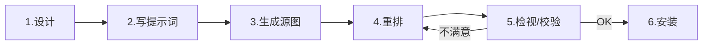

<div align="center">

# 🐾 Open Pets

### 给 [Codex CLI](https://github.com/openai/codex) 与 [Claude Code](https://www.anthropic.com/claude-code) 准备的桌面宠物工坊

**🌟 内置 AI Skill —— 让 agent 全自动完成"生图 → 切帧 → 校验 → 安装"**

[](LICENSE)
[](open-pet-creator/SKILL.md)
[](https://github.com/openai/codex)
[](https://www.anthropic.com/claude-code)
[](https://github.com/EASYGOING45/open-pets/stargazers)

[English](./README.en.md) · **简体中文**

<table>
<tr>
<td align="center" width="33%">
  <br>
  <b>Phrolova</b> · <i>鸣潮</i>
</td>
<td align="center" width="33%">
  <br>
  <b>粉星仔</b> · <i>洛克王国</i>
</td>
<td align="center" width="33%">
  <br>
  <b>迪莫</b> · <i>洛克王国</i>
</td>
</tr>
</table>

</div>

---

## 💡 这个仓库为什么特别？

> **它不止是一个宠物素材库——它本身就是一份可复用的 Skill。**

很多人会做几张宠物素材发到网上，但要让 AI agent 真正"理解"如何把它打包成符合 Codex 协议的桌面宠物，靠零散的脚本远远不够。`open-pet-creator` 把这个领域知识完整封装成了 **Codex CLI / Claude Code 通用的 Skill**：

- 你说一句"帮我把这张精灵图打包成桌面宠物"，agent 就会自动加载这份 Skill
- Skill 里写好了**契约**（1536×1872 / 8×9 网格 / 192×208 单元）、**调参规则**（`--scale` 与 `--offset-y` 的 trade-off）、**踩坑预案**（生成器源图列宽不齐时切换 `--detect-sprites`）
- 还附带 4 个确定性脚本：`repack` / `inspect` / `validate` / `install`，可被 agent 串起来组成完整流水线

> **🤖 → 这就是 Skill 的核心价值**：把人类专家的领域知识 + 工具，喂给 AI agent，让它在合适场景自动调用。Open Pets 同时是宠物商城 + Skill 范例 + 工具集合。

---

## 📦 仓库内含

<table>
<thead>
<tr><th>组件</th><th>说明</th><th>位置</th></tr>
</thead>
<tbody>
<tr>
<td>🤖 <b>open-pet-creator Skill</b></td>
<td>可被 Codex CLI 与 Claude Code 直接加载的 Skill 包，含 SKILL.md、4 个 Python 脚本、参考文档</td>
<td><a href="open-pet-creator/"><code>open-pet-creator/</code></a></td>
</tr>
<tr>
<td>🐾 <b>三只可直接安装的宠物</b></td>
<td>Phrolova、粉星仔、迪莫，每只都包含 9 行 × 8 列完整原子图与 <code>pet.json</code></td>
<td><a href="pets/"><code>pets/</code></a></td>
</tr>
<tr>
<td>📝 <b>设计文档与生成提示词</b></td>
<td>每只宠物的设计描述与可粘贴到图像生成器的 Final Prompt，照抄即可做下一只</td>
<td><a href="docs/"><code>docs/</code></a></td>
</tr>
<tr>
<td>✅ <b>回归测试套件</b></td>
<td>锁定 Codex 原子图契约（网格、单元尺寸、未用格透明）的契约测试</td>
<td><a href="tests/"><code>tests/</code></a></td>
</tr>
</tbody>
</table>

---

## 🚀 快速开始

### 路线 A：只想装一只宠物（30 秒）

```bash
git clone https://github.com/EASYGOING45/open-pets.git
cd open-pets

# 三选一：phrolova / pink-star / rocom-dimo
mkdir -p ~/.codex/pets/phrolova
cp pets/phrolova/spritesheet.webp ~/.codex/pets/phrolova/
cp pets/phrolova/pet.json         ~/.codex/pets/phrolova/

# 然后在 Codex 里重新选一次宠物（或重启），让缩略图缓存刷掉
```

### 路线 B：想用 AI agent 自己造宠物（推荐）

#### 第 1 步：安装 Skill

```bash
# Codex CLI
cp -R open-pet-creator ~/.codex/skills/open-pet-creator

# Claude Code
cp -R open-pet-creator ~/.claude/skills/open-pet-creator
```

#### 第 2 步：让 agent 帮你做剩下的事

接下来直接对 agent 描述需求即可，Skill 会被自动加载：

> 👤 **你**：我刚用 Midjourney 生成了一张精灵图，想做成 Codex 桌面宠物，源图在 `~/Downloads/dimo-source.png`
>
> 🤖 **Claude Code**（自动加载 `open-pet-creator` Skill）：
> 好的。源图来自图像生成器，先走 `--detect-sprites` 模式重排……
> ✅ Repack 完成：1536×1872 RGBA WebP，9 行全部通过协议校验
> ✅ Inspect：所有行 `top_min ≥ 38`，idle bbox 落在推荐区间
> 是否同步到 `~/.codex/pets/dimo/`？

> 💡 这是示意性对话。实际 agent 会按 Skill 里写的步骤跑 `repack_pet_atlas.py` → `inspect_pet_atlas.py` → `validate_pet_atlas.py` → `install_pet.py`。

---

## 🤖 关于 open-pet-creator Skill

<details>
<summary><b>Skill 是什么？为什么我们要把它做成 Skill 而不是普通脚本？</b>（点开展开）</summary>

<br>

**Skill** 是 Codex CLI 与 Claude Code 都支持的一种"领域工具包"格式：把某个垂直领域的知识、约束、脚本、文档打包到一个目录里，agent 在合适场景会**自动加载**。

相比普通脚本：

| | 普通脚本 | Skill |
| --- | --- | --- |
| **使用方式** | 用户得自己读 README、记参数 | agent 看到相关需求自动加载 |
| **携带的知识** | 只有代码逻辑 | 代码 + 契约文档 + 调参规则 + 踩坑预案 |
| **跨工具复用** | 各家工具各搞一套 | Codex / Claude Code 通用同一份 Skill |
| **演化** | 每次升级都要通知用户 | agent 每次调用都读最新的 SKILL.md |

把"打包桌面宠物"做成 Skill，意味着任何写代码的 AI agent 在用户提"我想做个 Codex 宠物"时，都能站在我们已经踩过坑的肩膀上做事。

</details>

### Skill 提供的能力

| 命令 | 干啥 |
| --- | --- |
| ✂️ `repack_pet_atlas.py` | 把任意尺寸的源精灵图重排成 Codex 标准 1536×1872 / 8×9 / 192×208 原子图。**支持 `--detect-sprites`** 处理生成器产的列宽不齐源图 |
| 🔍 `inspect_pet_atlas.py` | 列出每行 sprite 的尺寸、居中位置、顶部留白，做调参依据 |
| ✅ `validate_pet_atlas.py` | 检查格式、透明度、网格契约 |
| 📦 `install_pet.py` | 一键安装到 `~/.codex/pets/<id>/` |

详细使用说明见 [`open-pet-creator/SKILL.md`](open-pet-creator/SKILL.md)，原子图契约见 [`references/codex-pet-atlas.md`](open-pet-creator/references/codex-pet-atlas.md)。

---

## 🎨 自制一只新宠物（30 分钟全流程）



| 步骤 | 操作 | 文件参考 |
| ---: | --- | --- |
| 1 | **设计** —— 描述配色、辨识特征、每行姿势 | [`docs/rocom-dimo-pet-design.md`](docs/rocom-dimo-pet-design.md) |
| 2 | **写提示词** —— 改写 Final Prompt 块 | [`docs/rocom-dimo-generation-prompt.md`](docs/rocom-dimo-generation-prompt.md) |
| 3 | **生成** —— 1536×1664 PNG，8×8 单元，黑底 | gpt-image / Midjourney / SDXL |
| 4 | **重排** —— `repack_pet_atlas.py --detect-sprites` | Skill 自动调用 |
| 5 | **调参** —— `--scale` 与 `--offset-y`，目标 idle bbox 落入 `105-125 × 140-155` 且 `top_min ≥ 35` | `inspect_pet_atlas.py` |
| 6 | **安装** —— 拷到 `~/.codex/pets/<id>/` | `install_pet.py` |

> ⚠️ **不要照抄上一只宠物的 `--scale`**——轮廓不同决定上限不同（高耳兔 ≤ 1.0；矮胖型可到 1.05+）。新宠物一律从 `0.98` 起步。

---

## 📁 仓库结构

```text
open-pets/
├── 🤖 open-pet-creator/             ← 可复用 Skill（核心资产）
│   ├── SKILL.md                          Skill 元信息 + 调参规则
│   ├── agents/openai.yaml                agent 接入元信息
│   ├── references/codex-pet-atlas.md     Codex 原子图契约文档
│   └── scripts/                          repack / inspect / validate / install
│
├── 🐾 pets/                         ← 已收录宠物
│   ├── phrolova/  (鸣潮)
│   ├── pink-star/ (洛克王国)
│   └── rocom-dimo/(洛克王国)
│       └── 每只含 pet.json / spritesheet.webp / spritesheet-source.png / preview
│
├── 📝 docs/                         ← 设计文档 + 生成提示词模板
├── 🛠️ tools/                        ← 单宠物专用 repacker（路径硬编码）
├── ✅ tests/                        ← Codex 原子图契约的回归测试
├── README.md / README.en.md         ← 双语自述
└── LICENSE                          ← MIT
```

---

## 🤝 想加新宠物或扩展 Skill？

非常欢迎贡献！

<details>
<summary><b>加新宠物</b>（点开展开）</summary>

1. 提个 issue 描述角色，贴官方美术、列辨识特征
2. 用 `docs/<pet>-generation-prompt.md` 当模板生成源图
3. 提 PR，加入 `pets/<pet-id>/`、`docs/<pet-id>-pet-design.md` 与生成提示词
4. inspect 输出需所有行 `top_min ≥ 35`
5. 视觉风格保持 chibi，避免漂移到写实/painterly

</details>

<details>
<summary><b>扩展 Skill</b>（点开展开）</summary>

打包逻辑的 bug 修复、新校验器、其他 sheet 契约支持的 PR 都欢迎。改动 `open-pet-creator/scripts/` 下脚本时，记得：
- 同步更新 `SKILL.md` 中的相关章节（agent 读这份文档决定怎么用）
- 跑一遍 `python3 -m unittest tests/test_phrolova_spritesheet.py` 确认契约不被破坏
- 在 `references/codex-pet-atlas.md` 中补充对应的契约/调参说明

</details>

---

## 🧠 项目经验（已沉淀进 Skill）

两条踩过的坑，已写进 `open-pet-creator/SKILL.md`，agent 加载 Skill 时会自动获得这些知识：

| 坑 | 教训 |
| --- | --- |
| **照抄上只宠物的 `--scale`** | 不行。高耳轮廓 ≤ 1.0，矮胖型可到 1.05+。新宠物一律从 `0.98` 起步 |
| **生成器源图按等分网格切割** | 残片！必须用 `--detect-sprites`。gpt-image / Midjourney / SDXL 极少严格按等分网格出图 |

---

## 🙏 致谢与免责声明

这是一个**同人项目**，目的是个人桌面定制。所有角色形象致敬原作者：

- **Phrolova** —— *鸣潮 / Wuthering Waves* © Kuro Games
- **粉星仔 / Pink Star** 与 **迪莫 / Dimo** —— *洛克王国 / Roco World* © TaoMee

`open-pet-creator/`、`tools/`、`tests/`、`docs/` 中的代码与模板均为项目原创。**若您是版权方且希望下架某只具体宠物包，请提 issue 联系，会尽快配合移除。**

---

## 📄 协议

`open-pet-creator/`、`tools/`、`tests/` 与 `docs/` 中的代码与模板以 **MIT 协议**发布——见 [`LICENSE`](LICENSE)。`pets/` 下的宠物包属于同人创作，对应角色形象版权归原厂所有，仅用于个人桌面定制使用。

<div align="center">

---

⭐ **觉得有用就给个 Star 吧** ⭐

[报告 bug](https://github.com/EASYGOING45/open-pets/issues) · [建议宠物](https://github.com/EASYGOING45/open-pets/issues/new?labels=new-pet) · [English](./README.en.md)

</div>
